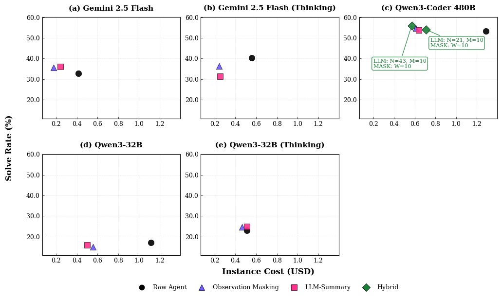

[]()
# The Complexity Trap: Simple Observation Masking Is as Efficient as LLM Summarization for Agent Context Management
*DISCLAIMER: Our work builds on SWE-agent, which this repository is a fork of. For documentation of SWE-agent, see the original [README](SWE-agent-README.md).*

<div style="text-align: center;">
    
</div>

This repo accompanies the paper [**"The Complexity Trap: Simple Observation Masking Is as Efficient as LLM Summarization for Agent Context Management"**](https://arxiv.org/abs/2508.21433) presented at the Fourth Deep Learning for Code (DL4Code) workshop at NeurIPS 2025 and Tobias Lindenbauer's Master's Thesis.

We find that:
1. Current efficiency-oriented agent context management methods consistently and significantly reduce cost by around 50% without significantly degrading downstream task performance.
2. The more recent LLM-Summary strategy is unable to consistently or significantly outperform a simple Observation Masking baseline, raising concerns about the optimality of the LLM-Summary strategy.
3. These effects generalize to the OpenHands agent scaffold.
4. Our novel combination of LLM-Summary and Observation Masking results in 7% and 11% cost reductions compared to just Observation Masking and LLM-Summary respectively. This innovative approach empirically highlights the untapped potential of efficiency-focused context management strategies for LLM agents.

If you used these data in your research, or it helped you form a hypothesis, please cite us:
```
@misc{lindenbauer2025complexitytrapsimpleobservation,
      title={The Complexity Trap: Simple Observation Masking Is as Efficient as LLM Summarization for Agent Context Management}, 
      author={Tobias Lindenbauer and Igor Slinko and Ludwig Felder and Egor Bogomolov and Yaroslav Zharov},
      year={2025},
      eprint={2508.21433},
      archivePrefix={arXiv},
      primaryClass={cs.SE},
      url={https://arxiv.org/abs/2508.21433}, 
}
```

## Contributions
- Implementation of an [**LLM-Summary context management strategy**](sweagent/agent/history_processors.py) within the SWE-agent scaffold.
- Orchestration scripts for use with local models and streamlined experimentation and reproducibility in the `scripts` folder.
- Released configurations used in our experiments in `config`.
- Released the raw experimental results of our main experiments in our HuggingFace dataset [here](https://huggingface.co/datasets/JetBrains-Research/the-complexity-trap).
- We release the code for the notebooks used to reproduce the plots shown in the main part of our work the `notebooks` folder as Python files. Use `jupytext --set-formats ipynb,py notebooks/<notebook>.ipynb` to transform them back to Jupyter notebooks.

## Setup 

To set up the project environment follow these steps:

1. Install [uv](https://docs.astral.sh/uv/)
2. Create a virtual environment based on Python 3.12
```bash
uv venv .venv --python 3.12 --seed
source .venv/bin/activate
```

3. Install the project dependencies:
```bash
uv sync --extra dev
```

**DISCLAIMER - Local models on devices without CUDA.**
Note that the optional dependency group `local-model` is intended for on-device LLM hosting for the agent. During installation `vLLM` checks for an available CUDA resource (Nvidia GPU). Because of this we have disabled the `local-model` dependency group on Mac devices. We strongly recommend setting this project up on a resource with CUDA if you want to locally host LLMs. If you want to try this on a device without CUDA regardless set:

```bash
export VLLM_BUILD_WITH_CUDA=0
export VLL
```

and remove the platform exclusion markers in `pyproject.toml`.

This is not officially supported by us and strongly advised against. We recommend using remote hosted LLMs on devices without CUDA.

## Running the agent
To run the agent use one of the existing configurations in `config`. Then you can launch the agent on the command line with e.g.:
```bash
sweagent run-batch \
    --config config/default_no_demo.yaml \
    --agent.model.name vertex_ai/gemini-2.5-flash \
    --agent.model.per_instance_call_limit 250.00 \
    --instances.type swe_bench \
    --instances.subset verified \
    --instances.split test \
    --num_workers 10
```
To enable context management, use one of the corresponding configurations. Additionally, you could configure things like:
```bash
sweagent run-batch \
    --config config/default_no_demo_checkpoint_same_model_openhands_N=21_M=10_masking_M=10.yaml \
    --agent.model.name vertex_ai/gemini-2.5-flash \
    --agent.type default \
    --agent.model.per_instance_call_limit 250.00 \
    --agent.model.per_instance_cost_limit 1.50 \
    --agent.model.temperature 0.8 \
    --agent.summary_model.name vertex_ai/gemini-2.5-flash \
    --agent.summary_model.temperature 0.0 \
    --agent.summary_model.per_instance_call_limit 0 \
    --instances.type swe_bench \
    --instances.subset verified \
    --instances.split test \
    --num_workers  \
    --instances.slice :10 \
    --output_dir trajectories/<USERNAME>/<DIRECTORY_NAME>
```
Please also refer to the [official SWE-agent documentation](https://swe-agent.com/latest/) for further details on config flags.

## Bedrock Usage

```bash
sweagent run-batch \
  --config config/default_no_demo_N=1_M=10.yaml \
  --agent.model.name bedrock/converse/qwen.qwen3-32b-v1:0 \
  --instances.type swe_bench --instances.subset verified \
  --instances.slice :5
```

Requires `AWS_DEFAULT_REGION` and either `AWS_BEARER_TOKEN_BEDROCK` or standard AWS credentials.

## LLM-Summary history processor
To enable the LLM-Summarizer, add it to your configuration as shown in [`default_no_demo_checkpoint_same_model_openhands_N=21_M=10.yaml`](config/default_no_demo_checkpoint_same_model_openhands_N=21_M=10.yaml). For details, see [the summarizer implementation](sweagent/agent/history_processors.py) and the [prompt construction and API call](sweagent/agent/models.py)

In the data reported for our main experiments, we use the following configurations:
- Raw Agent: [`default_no_demo_raw.yaml`](config/default_no_demo_raw.yaml)
- Observation Masking: [`default_no_demo_N=1_M=10.yaml`](config/default_no_demo_N=1_M=10.yaml)
- LLM-Summary: [`default_no_demo_checkpoint_same_model_openhands_N=21_M=10.yaml`](config/default_no_demo_checkpoint_same_model_openhands_N=21_M=10.yaml)

## Local Models
To evaluate local models, we provide the [`start_vllm_server.sh`](scripts/start_vllm_server.sh) and [`orchestrate_runs.py`](scripts/orchestrate_runs.py).

## Experimental data
Together with the agent scaffold we release experimental data of our main experiments together with notebooks for reproducing the main figures of shown in our work.

You can find the bundled archives containing our data in [our HuggingFace dataset repository](https://huggingface.co/datasets/JetBrains-Research/the-complexity-trap).

To reproduce our figures please download the trajectory data bundled with our project. Extract the `sweagent` trajectories and move them into `trajectories/lindenbauer/main-experiments`. `auxiliary-data/eval_results-swe_agent.tar` contains the SWE-bench evaluation outcomes of our `sweagent` experiments. Extract these data if you want to reproduce our experiments.

Regading OpenHands, our plotting code uses a cleaned version of the Openhands data that is available in `auxiliary-data`. However, we still release the full trajectories for transparency. 

The notebooks we release with this project require the extracted data to function properly.

Additionally, we release data on our statistical significance tests in `auxiliary-data` for transparency.

## Generality probing
In our work we report probing for generality with OpenHands. For this we forked the repository at commit fd3b4ac8e6db3103a3f8b488d44dd36e51e057be. We made minor modifications to their LLM-Summary implementation to allow experimentation with the same follow the official instructions [here](https://github.com/All-Hands-AI/OpenHands/blob/main/Development.md). Guidance on configuring an LLM and using an efficient context management strategy can be found [here](https://github.com/All-Hands-AI/OpenHands/tree/main/evaluation). We experiment with the context management implementations for Observation Masking and LLM-Summary found [here](https://github.com/All-Hands-AI/OpenHands/tree/main/openhands/memory/condenser/impl).

## 🪪 License <a name="license"></a>
MIT. Check `LICENSE`.